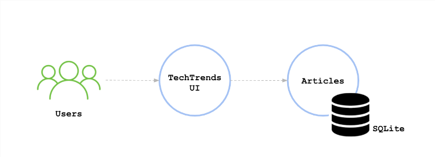
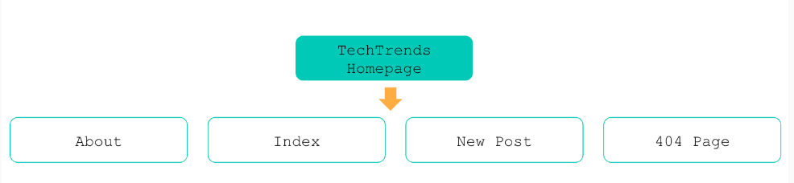
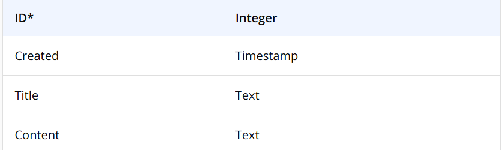

## Project Overview

TechTrends is an online website used as a news sharing platform, that enables consumers to access the latest news within the cloud-native ecosystem. In addition to accessing the available articles, readers are able to create new media articles and share them.

### Imagination scenario

You joined a small team as a Platform Engineer. The team is composed of 2 developers, 1 platform engineer (you), 1 project manager, and 1 manager. The team was assigned with the TechTrends project, aiming to build a fully functional online news sharing platform. The developers in the team are currently working on the first prototype of the TechTrends website. As a platform engineer, you should package and deploy TechTrends to Kubernetes using a CI/CD pipeline.

The web application is written using the Python Flask(opens in a new tab) framework. It uses SQLite(opens in a new tab), a lightweight disk-based database to store the submitted articles.

Below you can examine the main components of the firsts prototype of the application:

Additionally, the initial sitemap of the website can be found below:

Where:

- About page - presents a quick overview of the TechTrends site
- Index page - contains the content of the main page, with a list of all available posts within TechTrends
- New Post page - provides a form to submit a new post
- 404 page - is rendered when an article ID does not exist is accessed

And lastly, the first prototype of the application is storing and accessing posts from the "POSTS" SQL table. A post entry contains the post ID (primary key), creation timestamp, title, and content. The "POSTS" table schema can be examined below:

### Project Steps Overview

- Apply the best development practices and develop the status and health check endpoints for the TechTrends application.
Package the TechTrends application by creating a Dockerfile and Docker image.
- Implement the Continuous Integration practices, by using GitHub Actions to automate the build and push of the Docker image to DockerHub.
- Construct the Kubernetes declarative manifests to deploy TechTrends to a sandbox namespace within a Kubernetes cluster. The cluster should be provisioned using k3s in a vagrant box.
- Template the Kubernetes manifests using a Helm chart and provide the input configuration files for staging and production environments.
- Implement the Continuous Delivery practices, by deploying the TechTrends application to staging and production environments using ArgoCD and the Helm chart.